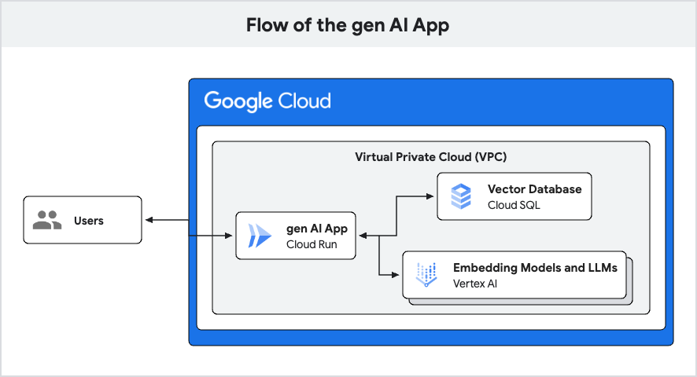
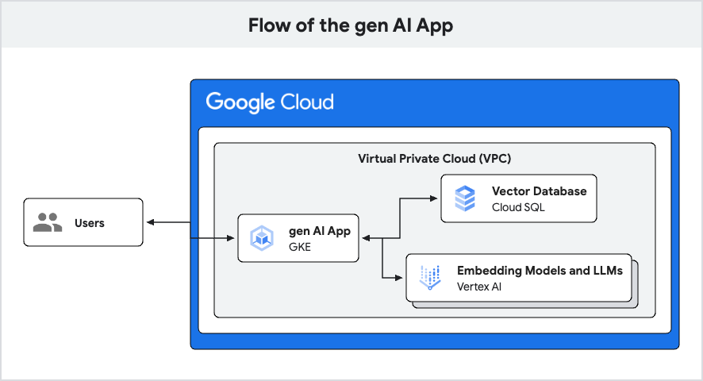

# Deploy a Application Development environment and a GenAI app in less than 30 minutes

Here is a jump start solution of how to build a basic chatbot API that:

- Leverages GKE or Cloud Run with AlloyDB, VertexAI, and pgvector
- Demonstrates connectivity to AlloyDB using Private Service Connect in a VPC
- Codifies all infrastructure including using Terraform
- Uses Python with asyncpg and FastAPI
- (optional) Supports cross-project setups with AlloyDB and GKE or Cloud Run
  in separate projects

## Choose your Architecture

This app can be deployed with two different flavors:

- Cloud Run
- Google Kubernetes Engine (GKE)

### Cloud Run ([README](run/README.md))

To deploy the app using Cloud Run head to the [run](run/README.md) folder.

### GKE ([README](gke/README.md))

To deploy the app using GKE head to the [gke](gke/README.md) folder.
